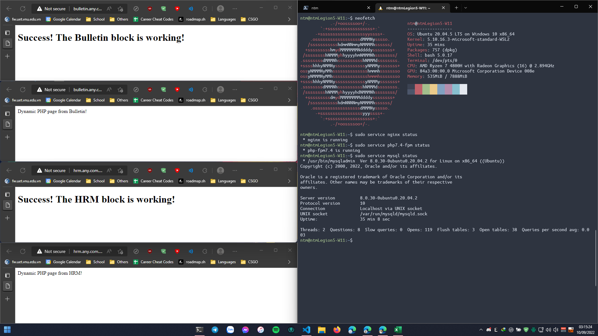

# Setting up a NGINX Server

This is my report for setting up a NGINX Server in Ubuntu under Windows 11 WSL (Windows Subsystem for Linux).

Week 1 exercise for INT3306 22 class - Web Application Development.


## Step 0: Installing WSL2

Since I already had WSL2 up and running on my personal computer, this step wasn't necessary. However, if you need a guide on how to setup a WSL2 environment, I suggest following [this](https://www.omgubuntu.co.uk/how-to-install-wsl2-on-windows-10) tutorial here.

I created a fresh instance of Ubuntu to start.


## Step 1: Updating Ubuntu and installing NGINX.

First, I did a full system update:
```
sudo apt update
sudo apt upgrade
```

Then, I installed _NGINX_:
```
sudo apt install nginx
```

Followed by starting _NGINX_ as a service:
```
sudo service nginx start
```

By now, I can start any browser from Windows host and access [localhost](http://127.0.0.1) for NGINX Welcome page.

## Step 2: Installing PHP and configure NGINX to work with PHP.
First, I installed _PHP_:
```
sudo apt install php-fpm php-mysql php-cli
```

Then, I configured _NGINX_ to work with _PHP-FPM_, by navigating to `/etc/nginx/sites-available/default` and changed:
```
#location ~ \.php$ {
#       include snippets/fastcgi-php.conf;
#
#       # With php7.0-cgi alone:
#       fastcgi_pass 127.0.0.1:9000;
#       # With php7.0-fpm:
#       fastcgi_pass unix:/run/php/php7.0-fpm.sock;
#}
```
to
```
location ~ \.php$ {
        fastcgi_buffering off;
        proxy_buffering off;

        include snippets/fastcgi-php.conf;
        fastcgi_pass unix:/run/php/php7.4-fpm.sock;
}
```
and added `index.php` to
```
# Add index.php to the list if you are using PHP
index index.html index.htm index.nginx-debian.html index.php;
```

Testing to make sure the config file were correct:
```
sudo nginx -t
```
```
nginx: the configuration file /etc/nginx/nginx.conf syntax is ok
nginx: configuration file /etc/nginx/nginx.conf test is successful
```

Restart _NGINX_ service and _PHP-FPM_ to finalize the setting:
```
sudo service nginx restart
sudo service php7.4-fpm restart
```

Finally, I created an example PHP webpage at `/var/www/html/index.php `:
```php
<?php
phpinfo();
```
[localhost](http://127.0.0.1) will now open info page of PHP.

## Step 3: Installing MySQL, phpMyAdmin
First, I installed _MySQL_:
```
sudo apt install mysql-server
```
Followed by starting _MySQL_ as a service:
```
sudo service mysql start
```

> **_NOTE:_**  On start, MySQL will throw an error:
> ```
> su: warning: cannot change directory to /nonexistent: No such file or directory
> ```
> Just ignore this.

Next, I installed _phpMyAdmin_:
```
sudo apt install phpmyadmin
```
> **_NOTE:_**  Since we're using _phpMyAdmin_ with _NGINX_, default configuration for _Apache2_ or _lighttpd_ are unnecessary.

> **_NOTE:_**  Make sure to finish installing _MySQL_ first in order for _phpMyAdmin_'s setup to configure database with _dbconfig-common_.

Made a symlink from _phpMyAdmin_'s files to _PHP_'s root web folder:
```
sudo ln -s /usr/share/phpmyadmin /var/www/html
```

And restart _NGINX_ service to finalize the setting:
```
sudo service nginx restart
```

> **_NOTE:_**  At this point, [localhost/phpmyadmin/](http://127.0.0.1/phpmyadmin) is accessible but throws HTTP error 500. `/var/log/nginx/error.log` throws an error:
> <details>
> <summary>Click this to collapse/fold.</summary>
> <pre><code>[error] 8274#8274: *21 FastCGI sent in stderr: "PHP message: PHP Fatal error:  Uncaught Error: Call to undefined function PhpMyAdmin\mb_strpos() in /usr/share/phpmyadmin/libraries/classes/Url.php:253
> Stack trace:
> #0 /usr/share/phpmyadmin/libraries/classes/Url.php(206): PhpMyAdmin\Url::getArgSeparator()
> #1 /usr/share/phpmyadmin/libraries/classes/Url.php(169): PhpMyAdmin\Url::getCommonRaw()
> #2 /usr/share/phpmyadmin/libraries/classes/Core.php(749): PhpMyAdmin\Url::getCommon()
> #3 /usr/share/phpmyadmin/libraries/classes/Core.php(330): PhpMyAdmin\Core::linkURL()
> #4 /usr/share/phpmyadmin/libraries/classes/Core.php(353): PhpMyAdmin\Core::getPHPDocLink()
> #5 /usr/share/phpmyadmin/libraries/classes/Core.php(973): PhpMyAdmin\Core::warnMissingExtension()
> #6 /usr/share/phpmyadmin/libraries/common.inc.php(106): PhpMyAdmin\Core::checkExtensions()
> #7 /usr/share/phpmyadmin/index.php(27): require_once('/usr/share/phpm...')
> #8 {main}
> thrown in /usr/share/phpmyadmin/libraries/classes/Url.php on line 253" while reading response header from upstream, client: ::1, server: _, request: "GET /phpmyadmin/ HTTP/1.1", upstream: "fastcgi://unix:/var/run/php/php7.4-fpm.sock:", host: "localhost"</code></pre>
> </details>

To fix this, go to _PHP_'s config file at `/etc/php/7.4/cli/php.ini` and uncomment out a necessary PHP's extension:
```ini
;extension=mbstring
```
to enable the required extension and restart _PHP-FPM_ service:
```
sudo service php7.4-fpm restart
```

By now, [localhost/phpmyadmin/](http://127.0.0.1/phpmyadmin) should be accessible and greets you with phpMyAdmin login page. Login with username **phpmyadmin** and password that you've configured.

## Step 4: Domain hosting
Since we're local hosting, domains should be routed directly to [localhost](http://127.0.0.1) IP address.

Since I'm on WSL2, `/etc/hosts` is automatically update with Windows's hosts file (at `%windir%\System32\drivers\etc\hosts`), so I can just add any host entries to Windows's hosts file and it will automatically update on both.

Added entries:
```
127.0.0.1 bulletin.any.com.vn
127.0.0.1 hrm.any.com.vn
```

Next, I created folders for each corresponding page and set its permission:
```
sudo mkdir -p /var/www/bulletin.any.com.vn
sudo mkdir -p /var/www/hrm.any.com.vn

sudo chown -R $USER:$USER /var/www/bulletin.any.com.vn
sudo chown -R $USER:$USER /var/www/hrm.any.com.vn
sudo chmod -R 755 /var/www/bulletin.any.com.vn
sudo chmod -R 755 /var/www/hrm.any.com.vn
```

Then, I created example webpages for Bulletin at `/var/www/bulletin.any.com.vn/index.htm`:
```html
<!DOCTYPE html>
<html>
    <head>
        <title>Welcome to Bulletin!</title>
    </head>
    <body>
        <h1>Success! The Bulletin block is working!</h1>
    <body>
</html>
```
and `/var/www/bulletin.any.com.vn/test.php`:
```php
<?php
echo "Dynamic PHP page from Bulletin!";
```
Repeats with HRM.

Next, I created server blocks for each webpages by making a copy of `/etc/nginx/sites-available/default` to its corresponding folders:
```
sudo cp /etc/nginx/sites-available/default /etc/nginx/sites-available/bulletin.any.com.vn
sudo cp /etc/nginx/sites-available/default /etc/nginx/sites-available/hrm.any.com.vn
```
And change the config of `/etc/nginx/sites-available/bulletin.any.com.vn` to:
```
server {
        listen 80;
        listen [::]:80;
        root /var/www/bulletin.any.com.vn;
        index index.html index.htm index.php;
        server_name bulletin.any.com.vn;
        location / {
                try_files $uri $uri/ =404;
                autoindex on;
        }

        location ~ \.php$ {
                fastcgi_buffering off;
                proxy_buffering off;

                include snippets/fastcgi-php.conf;
                fastcgi_pass unix:/var/run/php/php7.4-fpm.sock;
        }
}
```
Repeats with HRM.

Then, I enabled server blocks:
```
sudo ln -s /etc/nginx/sites-available/bulletin.any.com.vn /etc/nginx/sites-enabled/
sudo ln -s /etc/nginx/sites-available/hrm.any.com.vn /etc/nginx/sites-enabled/
```
and restart _NGINX_:
```
sudo service nginx restart
```
Now, all of these URL should be accessible by any browser from Windows host:
```
http://bulletin.any.com.vn
http://bulletin.any.com.vn/test.php
http://hrm.any.com.vn
http://hrm.any.com.vn/test.php
```
# Result:

